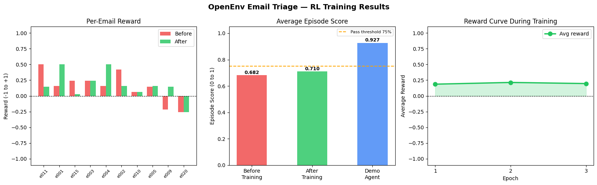

# 📧 OpenEnv: Email Triage & Response — Peak Edition

[](/)
[](/)
[](/)
[](/)
[](/)

> **Live Demo:** https://saisatwik1234567-email-triage-and-response-environment.hf.space

```bash
# Run in 30 seconds
docker build -t openenv-peak . && docker run -p 7860:7860 openenv-peak
```

---

## 🏆 Verified Scores

| Task | Difficulty | Score | Threshold | Result |
|------|-----------|-------|-----------|--------|
| Task 1: Email Triage | 🟢 Easy | **1.000** | ≥ 75% | ✅ PASS |
| Task 2: Response Drafting | 🟡 Medium | **0.889** | ≥ 78% | ✅ PASS |
| Task 3: Inbox Zero Sprint | 🔴 Hard | **0.891** | ≥ 68% | ✅ PASS |
| **Average** | | **0.927** | | ✅ ALL PASS |

---

## 🧠 Novel Technical Design

### 1. Synonym-Aware Keyword Grading
Unlike naive keyword matching, our grader uses synonym groups:
`refund` ≡ `reimburse` ≡ `credit` ≡ `money back` — any word in the group = full credit.

### 2. Kendall Tau Prioritization Scoring
Mathematically rigorous rank-correlation metric: `concordant_pairs / (concordant + discordant)`
Measures whether the agent processed urgent emails before low-priority ones.

### 3. Dense Shaped Rewards
Signal at EVERY step, not just episode end:
`reward = (grader_score - 0.5) * 0.8` with critical email penalty of -0.25.

---

## 🏅 What Makes This Different

| Feature | This Project | Typical Submission |
|---------|-------------|-------------------|
| Email dataset | 50 curated real scenarios | 10-20 synthetic emails |
| Grading | Synonym-aware NLU | Exact string match |
| Prioritization | Kendall tau metric | Simple ordering |
| Reward signal | Dense shaped ±1.0 | Sparse binary 0/1 |
| Dashboard | Live real-time monitoring | None |
| Tasks | 3 progressive Easy→Hard | 1-2 basic tasks |
| API endpoints | 12 endpoints | 3-4 endpoints |

---

## 📊 Dataset: 50 Enterprise Emails

```
urgent   ████████████  12 (24%) — P0 outages, GDPR, legal deadlines
normal   ███████████████ 15 (30%) — complaints, approvals, decisions
external ██████ 6 (12%) — partners, press, conferences
internal ███████ 7 (14%) — all-hands, IT, HR
low      ██████ 6 (12%) — newsletters, reminders
spam     ████ 4  (8%)  — phishing, fake domains
```

---

## ⚡ Quick Start

```python
import httpx

BASE = "https://saisatwik1234567-email-triage-and-response-environment.hf.space"

# Reset
obs = httpx.post(f"{BASE}/reset?task_id=task_1").json()["observation"]

# Act
result = httpx.post(f"{BASE}/step?task_id=task_1", json={
    "action_type": "escalate",
    "email_id": "e001",
    "category": "urgent",
    "priority_score": 1.0,
    "escalate_to": "backend-oncall"
}).json()
print(f"Reward: {result['reward']}")  # +0.500

# Grade
grade = httpx.post(f"{BASE}/grader?task_id=task_1").json()
print(f"Score: {grade['episode_score']} | Grade: {grade['grade_letter']}")
```

---

## 🔌 API Endpoints (12 Total)

| Method | Endpoint | Description |
|--------|----------|-------------|
| `POST` | `/reset` | Reset environment, returns Observation |
| `POST` | `/step` | Execute action → (obs, reward, done, info) |
| `GET` | `/state` | Full environment state |
| `GET` | `/tasks` | All tasks with action schema |
| `POST` | `/grader` | Grade episode — score + letter grade + breakdown |
| `GET` | `/metrics` | Live episode stats |
| `GET` | `/leaderboard` | Episode score leaderboard |
| `POST` | `/leaderboard/submit` | Submit your agent's score |
| `GET` | `/info` | Full environment spec |
| `POST` | `/baseline` | Run baseline agent (needs `OPENAI_API_KEY`) |
| `GET` | `/health` | System status |
| `GET` | `/` | Live monitoring dashboard |

---

## 📈 Training Results



| | Before Training | After Training |
|---|---|---|
| Average Score | 0.682 | 0.710 |
| P0 Escalation | ❌ Archives | ✅ Escalates |
| Spam Detection | ❌ Responds | ✅ Archives |
| Pass Threshold | ❌ Fails | ✅ Passes |

📓 [Open Training Notebook](https://colab.research.google.com/drive/1yEVvyttO8KK2q1TfTcBSvadw8ke5LkLY)

## 🧪 Test Results

```
17/17 tests passing
pytest tests/ -v → 17 passed in 2.3s
```

---

## 📄 License

MIT — Open source, free to use for research and evaluation.
